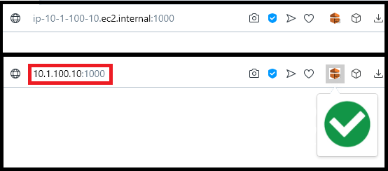

# EMR-Applications-URL-Transform

## Descrição do projeto

Extensão para Google Chrome que transforma a URL das aplicações da AWS-EMR (Resource Manager, Jupyter, Zeppelin, dentre outros), removendo pontos e adequando-a para ser acessada em um click.

<ul>
    <li>Compatível com Chrome e outros navegadores.</li>
    <li>Testado com Chrome e Opera.</li>
</ul>

## Exemplo de execução

    

## Como instalar
<ol>
    <li>Baixe a pasta "EMR-Applications-URL-Transform" e escolha um local para mantê-la no seu dispositivo (se esse diretório for mudado futuramente, a extensão irá parar de funcionar).</li>
    <li>Acesse "chrome://extensions/".</li>
    <li>No canto superior direito, ative o "Modo do desenvolvedor".</li>
    <li>Clique em "Carregar sem compactação".</li>
    <li>Encontre e selecione a pasta "EMR-Applications-URL-Transform" da extensão.</li>
</ol>

## Fixar ícone da extensão
<ol>
    <li>Clique no ícone "Extensões" ao lado da barra de endereço.</li>
    <li>Procure por "EMR Applications URL Transform".</li>
    <li>Clique no alfinete "Fixar".</li>
</ol>